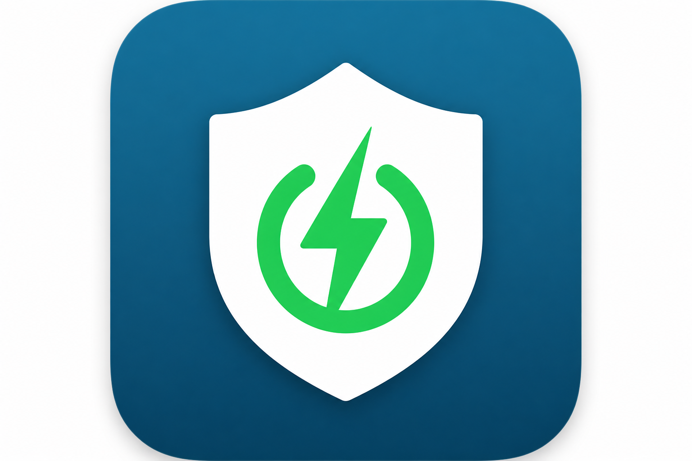
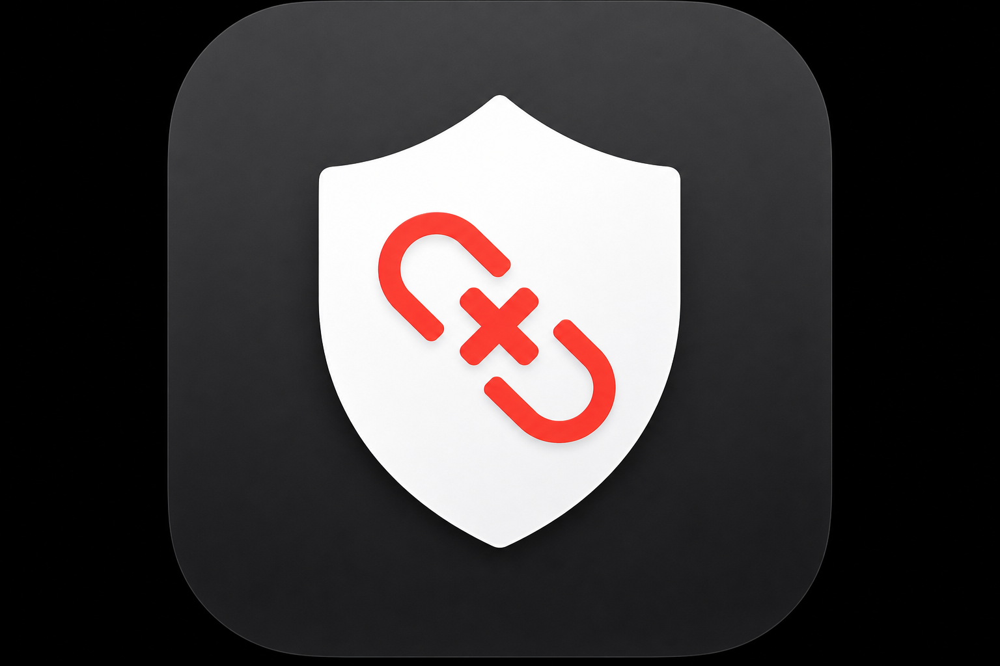

# VpnSnap

在 macOS 上一鍵連線 **Cisco Secure Client（AnyConnect）** 的輕量工具。

不用每次打開官方 App、選伺服器、輸入密碼——點一下 **VpnSnap** 或一行指令就能連上。

<p align="center">
  
  
</p>

## 原理

這不是新的 VPN 客戶端，而是包在 Cisco 官方 CLI 外面的自動化外殼：

```
你 → vpn-connect → 讀設定 + Keychain → Cisco CLI → VPN 連線
```

| 元件 | 位置 | 說明 |
|------|------|------|
| 指令入口 | `bin/vpn-connect` 等 | 連線 / 斷線 / 查狀態 |
| 共用邏輯 | `lib/common.sh` | 讀設定、Keychain、組互動輸入 |
| 設定檔 | `~/.config/vpn-mac/config.env` | VPN 位址、帳號、選項 |
| 密碼 | macOS Keychain | 獨立存放，不寫進設定檔 |
| 底層 | `/opt/cisco/secureclient/bin/vpn` | Cisco 官方程式 |

## 前置需求

- macOS 12+
- 已安裝 [Cisco Secure Client](https://www.cisco.com/c/en/us/support/security/secure-client-vpn-macos/products-installation-guides-list.html)（AnyConnect）
- CLI 可執行，常見路徑：

  ```bash
  /opt/cisco/secureclient/bin/vpn
  ```

## 安裝

```bash
git clone git@github.com:gumpcpy/vpn-snap.git
cd vpn-snap

./setup.sh
```

`setup.sh` 會自動：

- 建立 `~/.config/vpn-mac/config.env`（從範本複製）
- 在 `~/.local/bin/` 建立 `vpn-connect`、`vpn-disconnect`、`vpn-status` 指令
- 在 `~/Applications/` 建立可雙擊的 **VpnSnap.app**、**VpnSnap Disconnect.app**（含自訂圖示）

### 設定 PATH（若終端機找不到指令）

```bash
echo 'export PATH="$HOME/.local/bin:$PATH"' >> ~/.zshrc
source ~/.zshrc
```

## 設定

設定分兩層：

| 檔案 | 內容 |
|------|------|
| `~/.config/vpn-mac/config.env` | 全域設定（Keychain、憑證選項、預設線路） |
| `~/.config/vpn-mac/profiles/*.env` | 各條線路（host、帳號） |

### 1. 全域設定

```bash
nano ~/.config/vpn-mac/config.env
```

```bash
ACTIVE_PROFILE="primary"              # 預設線路
KEYCHAIN_SERVICE="vpn-mac"
VPN_BIN="/opt/cisco/secureclient/bin/vpn"
TRUST_SERVER_CERT="y"
IMPORT_SERVER_CERT="y"
MFA_OPTION=""
```

### 2. 線路設定（可放多條）

```bash
# 主線路
nano ~/.config/vpn-mac/profiles/primary.env
```

```bash
PROFILE_LABEL="主線路"
VPN_HOST="70.36.125.49:5001"
VPN_USER="gumpcpy"
```

```bash
# 備用線路
nano ~/.config/vpn-mac/profiles/backup.env
```

```bash
PROFILE_LABEL="備用線路"
VPN_HOST="另一個.ip:5001"
VPN_USER="gumpcpy"
```

### 3. 儲存密碼到 Keychain

```bash
./setup-keychain.sh
```

密碼只存在本機 Keychain，**不會**寫進 repo 或設定檔。

## 使用方式

### 終端機

```bash
vpn-list                  # 列出所有線路
vpn-connect               # 用預設線路連線
vpn-connect backup        # 臨時用備用線路連（不改預設）
vpn-switch backup         # 切換預設線路，並可立即連線
vpn-disconnect            # 斷線
vpn-status                # 查狀態
```

### 圖形介面

- Spotlight 搜尋 **VpnSnap** 或 **VpnSnap Disconnect**
- 或到 `~/Applications/` 雙擊 App

連線成功或失敗時會顯示 macOS 系統通知。

## 搬到另一台 Mac

1. 在新電腦安裝 Cisco Secure Client
2. Clone 本 repo
3. 執行 `./setup.sh`
4. 編輯 `~/.config/vpn-mac/config.env`（可複製舊機設定內容）
5. **重新執行** `./setup-keychain.sh`（Keychain 無法跨機複製）
6. 測試 `vpn-connect`

## 專案結構

```
vpn-snap/
├── profiles/
│   ├── primary.env.example   # 主線路範本
│   └── backup.env.example    # 備用線路範本
├── assets/icons/
│   ├── connect.png       # VpnSnap 連線圖示
│   └── disconnect.png    # VpnSnap 斷線圖示
├── bin/
│   ├── vpn-connect       # 一鍵連線（可指定線路）
│   ├── vpn-disconnect    # 斷線
│   ├── vpn-status        # 查狀態
│   ├── vpn-list          # 列出線路
│   └── vpn-switch        # 切換預設線路
├── lib/
│   ├── common.sh         # 共用邏輯
│   └── icons.sh          # 圖示轉換
├── config.env.example    # 設定範本（可提交）
├── setup.sh              # 安裝腳本
├── setup-keychain.sh     # Keychain 密碼設定
├── README.md
└── .gitignore
```

## 疑難排解

### `command not found: vpn-connect`

確認 PATH 包含 `~/.local/bin`，或執行 `source ~/.zshrc`。

### 憑證警告 / 帳密錯位

用 IP 連線時，Cisco 會先問兩次憑證確認，再要帳密。請確認：

```bash
TRUST_SERVER_CERT="y"
IMPORT_SERVER_CERT="y"
```

### `Login failed`

密碼可能錯誤或過期，重新執行：

```bash
./setup-keychain.sh
```

### 有二次驗證（2FA）

在 `config.env` 設定 `MFA_OPTION` 為對應選項編號（需依你公司 VPN 的提示調整）。

## 安全提醒

- **不要**把 `config.env` 或密碼提交到 Git
- Keychain 密碼每台 Mac 需各自設定
- 本工具適合個人／受信任環境使用；請遵守公司 IT 政策

## License

MIT
